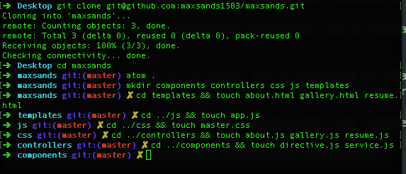

# maxsands1503.com
## My Portfolio Site
### Objective:
The objective of this walkthrough is to teach how to create a simple portfolio website using AngularJS, jQuery,
HTML, CSS, Bootstrap and FTPing to a hosted domain. The end product will be a single page app that displays different bits of information depending on the page.

### Website structure
There will be four pages. The first is going to be a pretty landing page, with an image slider in background, the links to the About section. The About section will give a breakdown of my goals, my past and what development environments I enjoy.  The next section will be a gallery of my projects. The final page will be a resume page, with a button to download my resume.

## Disclaimer
This tutorial will go over the use of [FTP](https://en.wikipedia.org/wiki/File_Transfer_Protocol) (File Transfer Protocol), if you do not already own a domain or have a hosting account, that is OK, you can deploy your project to Firebase.

##Step 1
Start a github repository. We will be committing frequently during this project. Clone the repository to your machine.  

##Step 2
Building out our file structure, we will begin with an 'index.html' file in our root. Next we will create our subdirectories. The subdirectories are 'components', 'controllers', 'css', 'js' and 'templates'.  
```
touch index.html && mkdir components controllers css js templates

```
We may not end up using all of those, but we are doing an organic walkthrough, wherever creativity takes us, that is where we are headed.

In 'templates' create 'about.html', 'gallery.html' and 'resume.html'.  
```
cd templates && touch about.html gallery.html resume.html
```

In 'js' we will add an 'app.js' file.   
```
cd ../js && touch app.js
```
In 'css' we will add a 'master.css' file, we may add more css files later, but for now we will start with one.   
```
cd ../css && touch master.css
```
In our 'controllers' directory we will add a controller file for each page (excluding our index.html). We will create 'about.js', 'gallery.js' and 'resume.js'.  
```
cd ../controllers && touch about.js gallery.js resume.js

```
The components directory will have two files, 'directive.js' and 'service.js', we may not end up using them, but you know, better to have and not need...  
```
cd ../components && touch directive.js service.js
```


#COMMIT YOUR STUFF!
Seriously, get into the habit of committing your work often. If you are eventually deploying to Firebase or Heroku, do that now too. 
